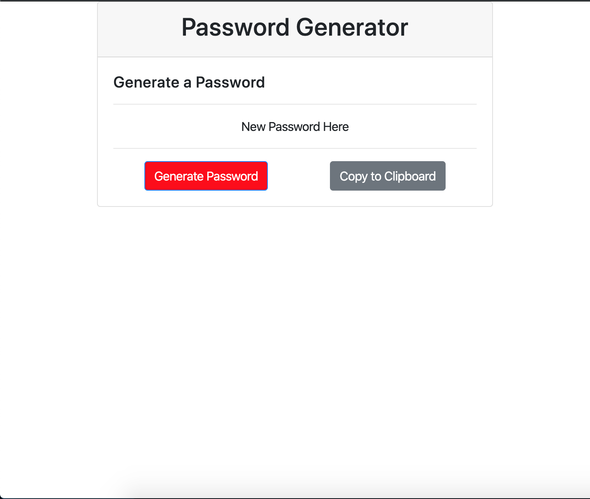

# Homework-3

The purpose of this project was to build a random password generator using HTML, CSS, and JavaScript. The criteria for success were as follows:

* Create a dynamic and responsive HTML document with CSS and JavaScript.
* Users should be prompted to answer questions about their desired password (number of characters; if they want special characters, numbers, upper, and lower case letters). 
* After answering all prompts, a password is generated based off of the user's chosen criteria and displayed on screen. The password could be displayed via an alert, but it was encouraged to have it written on the HTML.

The bonus objective of the project was to have a functioning button that allowed the user to copy the newly generated password to their clipboard. 

## Getting Started

The deployed project should look like this.

Below is the link to the project repository followed by the link to the live website. 

https://github.com/jcw2865/homework-3
https://jcw2865.github.io/homework-3/

### Development

I will now attempt to enumerate the steps I took in the development of this project. This being my first project with JS, my process was not as efficient as it could have been, and it was a great learning experience. 

1. Created index.html, style1.css, and script.js. 

2. General HTML document structure added to index.html. 

3. Bootstrap styling, style1.css, and script.js linked to index.html. 

4. Card template and contact info template from bootstrap merged and implemented in index.html for desired appearance. 

5. Created initial variables that I knew I would need in script.js (length of password, special characters, numbers, upper and lower case letters). 

6. Added functionality to the two buttons (Generate Password and Copy to Button). The functionality was just console.log to verify the click event worked.

7. Added the conditional if-else statements based off of the user prompts. 

8. At the end of each conditional statement, characters were either added to or excluded from a bank of all potential characters (variable charBank).

9. After all conditional statements were answered, Math.random was used to pick characters from charBank at the chosen character limit. 

10. "document.querySelector("#newpass").value = newPassEl;" was used to write the new password out in the input box on the HTML document. .value was used instead of .textContent because .textContent will not work on an input box (which doesn't have text).

11. Created a function utilizing .select() and document.execCommand("copy") to copy the text/value from the input box to the user's clipboard.

## Testing

After each function or variable was created, I used console.log to validate whether or not it executed succesfully. I frequently referenced Google Chrome's inspector/console to see where the errors took place when they did occur. 

## Deployment

This program can be deployed using most internet browsers via the links in the "Getting Started" section. 

## Built With

* [VSCode](https://code.visualstudio.com/)
* [Bootstrap](https://getbootstrap.com/)
* [W3Schools](https://www.w3schools.com/) - Copy to clipboard function.
* [GoogleChrome](https://www.google.com/chrome/) - Used for inspector tool and validating the program during development. 

<!-- ## Contributing

Please read [CONTRIBUTING.md](https://gist.github.com/PurpleBooth/b24679402957c63ec426) for details on our code of conduct, and the process for submitting pull requests to us. -->

## Authors

* **Jake Walker** - [jcw2865](https://github.com/jcw2865)

<!-- See also the list of [contributors](https://github.com/your/project/contributors) who participated in this project. -->

<!-- ## License

This project is licensed under the MIT License - see the [LICENSE.md](LICENSE.md) file for details -->

## Acknowledgments

* The advisors, instructors, and TAs at the Coding Bootcamp at the University of Texas at Austin
* Fellow classmates at the Coding Bootcamp at UT-Austin
* Friends in the industry
